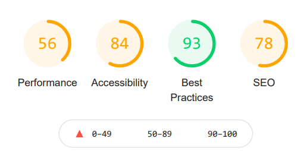
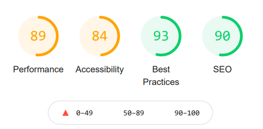
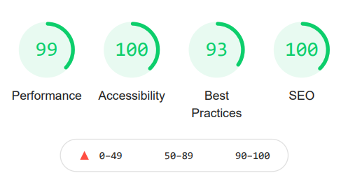
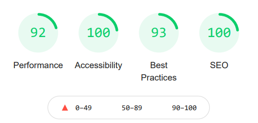
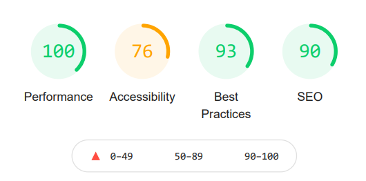
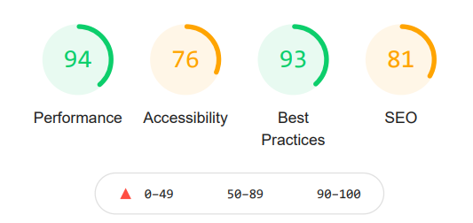
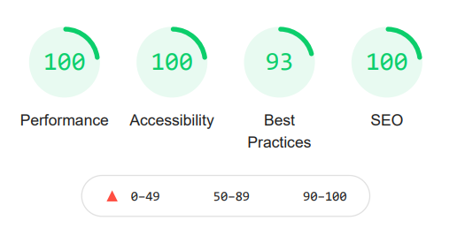
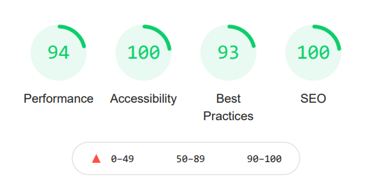
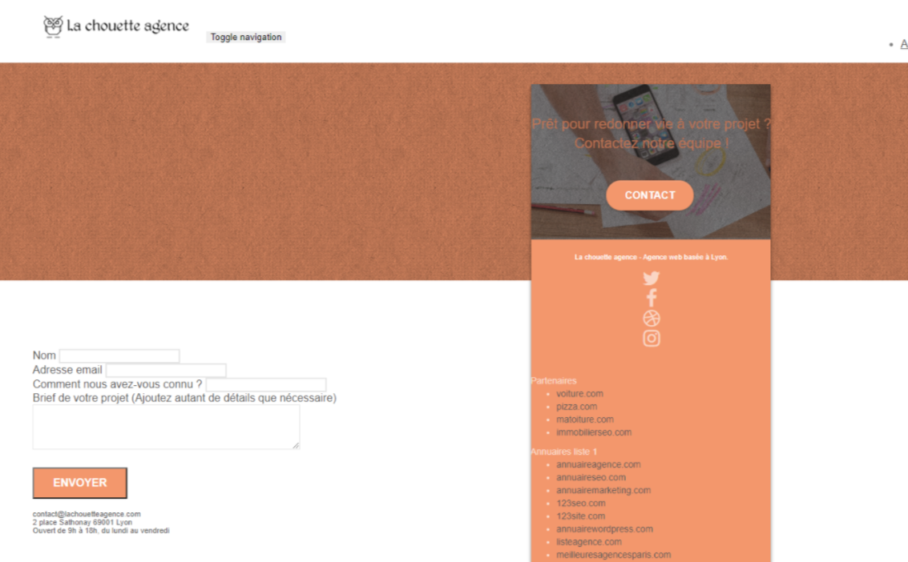
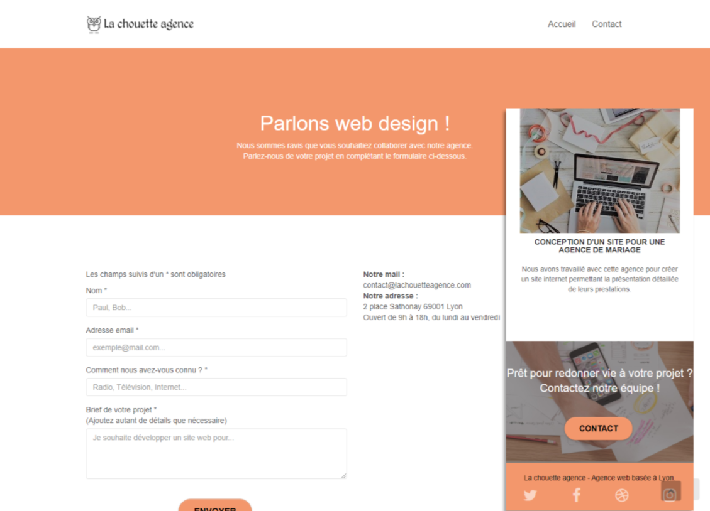

# La chouette agence

## Fourth project with Openclassrooms

The objective of this project was to optimize an already existing website. For that, it was important to:

-   Provide an SEO analysis report of the site, in which we clearly identify 10 priority recommendations;
-   The complete source code of the improved site;
-   An optimization report including a comparison of the results (including loading speed and accessibility).

## Lighthouse results

### Initial home page, Desktop then mobile

### Optimized home page, Desktop then mobile

### Initial contact page, Desktop then mobile

### Optimized contact page, Desktop then mobile

## Recommendations application

### Accessibility

-   Use a contrast analysis tool to re-evaluate it, modify the colors to clearly differentiate the text from the background.
    (A contrast ratio of 4.5: 1 for normal texts)
    (A contrast with a ratio of 3: 1 for large texts)

-   Choose a suitable font size to make it easier to read

-   Make sure that all the content is available on the page thanks to the style.

-   Be careful about the style overlay, which can sometimes lead to a loss of content.

-   Harmonize the pages to obtain a coherent content, here, implement the same Navbar as on the home page to limit this kind of problem for example.

-   It is important to support the user in entering a form through:
    (colored, text, icons, entertainment...)In addition, the input fields must be identifiable via their labels.

## Before

## After

